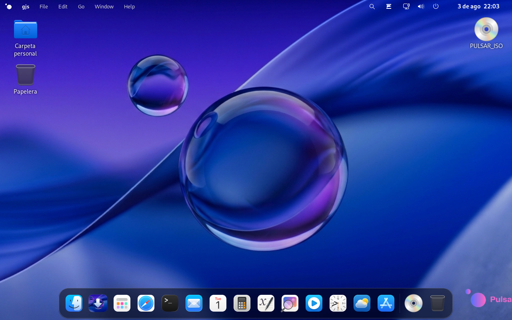

<div align="center">

# PulsarOS

### The operating system that remembers you.

[](https://astro.build)
[](https://tailwindcss.com)
[](https://gsap.com)
[](https://typescriptlang.org)
[](https://pnpm.io)



**[Live Site →](https://bittenfruit.inled.es/)**

</div>

---

## Features

- **Spotlight Search** — Find anything, instantly.
- **Time Machine** — Travel back through your session history.
- **Window Modes** — Snap, tile, or float your windows.
- **Cloud Providers** — iCloud, Google Drive, OneDrive, Nextcloud, and more.
- **App Store** — Native apps built for PulsarOS.
- **Session Restore** — Pick up exactly where you left off.

## Getting Started

### Prerequisites

- [Node.js](https://nodejs.org) >= 22.12.0
- [pnpm](https://pnpm.io) (recommended)

### Install

```bash
# Clone
git clone https://github.com/your-org/pulsaros-landing.git
cd pulsaros-landing

# Install with scripts disabled (security)
pnpm install --ignore-scripts
```

### Develop

```bash
pnpm dev
```

Open [http://localhost:4321](http://localhost:4321).

### Build

```bash
pnpm build
pnpm preview
```

## Project Structure

```
src/
├── animations/       # GSAP scroll + entrance animations
├── assets/           # Processed static assets
├── components/       # 17 Astro section components
├── config/           # Site configuration
├── layouts/          # Base layout wrapper
├── lib/              # GSAP setup, shared utils
├── pages/            # Routes (index, 404, robots.txt)
├── styles/           # Global CSS + design tokens
├── types/            # TypeScript types
└── utils/            # Helper functions
```

## Design System

Full spec lives in [`DESIGN.md`](DESIGN.md). Apple.com-inspired: spacious heroes, pill buttons, SF Pro type, minimal chrome.

| Token | Description |
|-------|-------------|
| `--color-primary` | `#0071e3` — brand blue for CTAs |
| `--color-secondary` | `#0066cc` — links and outlines |
| `--font-display` | SF Pro Display — hero headlines |
| `--font-text` | SF Pro Text — body and labels |
| `--radius-full` | `980px` — pill button shape |

Components use CSS custom properties via Tailwind arbitrary values. No hardcoded hex in markup.

## Security

Scripts are disabled by default during install:

```bash
pnpm install --ignore-scripts
```

This prevents post-install hooks from running untrusted code. The only allowed build script is `esbuild` (configured in `pnpm-workspace.yaml`).

---

<div align="center">
  <sub>Built with care by the PulsarOS team.</sub>
</div>
